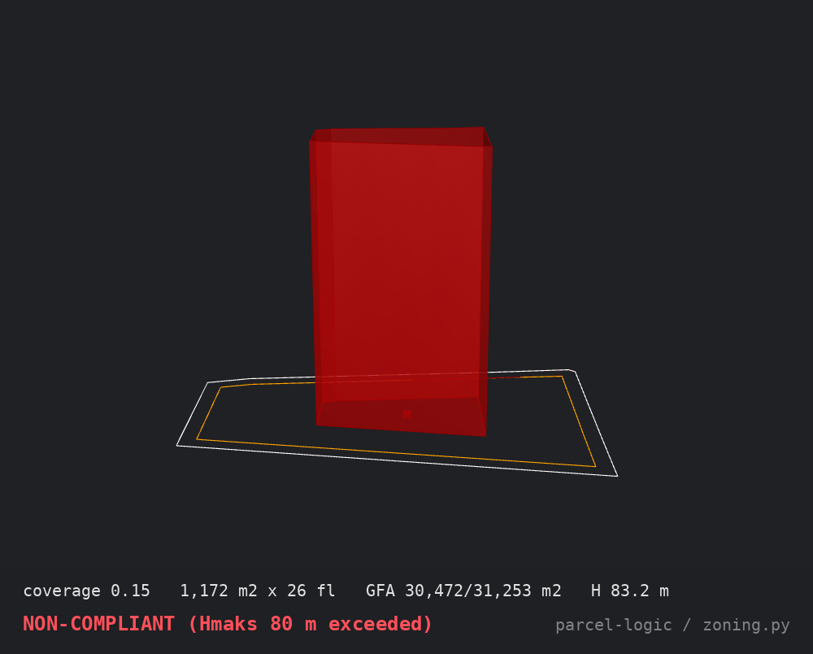

# parcel-logic

**Turkish zoning rules as executable code, tested against a real Istanbul parcel.**

Part of [Parcel Logic](https://archicoder.com), a constraint-to-form lab for computational massing.

**V01 — complete.** One real parcel (Merdivenköy 3412/3, Kadıköy) taken from cadastral fact to 126 judged massing candidates, rules encoded as tested code, every mistake on the record. Browse them in the [Design Explorer](https://wmgarchitect.github.io/parcel-logic/explorer/). Full build log at [archicoder.com](https://archicoder.com).



## The idea

Three numbers govern what can be built on a Turkish parcel:

| Rule | Meaning | This site |
|---|---|---|
| **KAKS** (emsal / FAR) | total floor area ceiling, as a multiple of parcel area | 4.00 |
| **TAKS** | footprint ceiling, as a fraction of parcel area | 0.50 |
| **Hmaks** | maximum building height | 80 m |

On the study parcel — **Merdivenköy 3412/3, Kadıköy, Istanbul, 7,813.31 m²** — those numbers allow **31,253 m² of legal floor area**. What they *don't* do is choose the building. An 8-floor fat slab, a 20-floor slim tower, and 25-floor twin towers are all equally legal:

```
A - fat slab:     3,907 m2 x  8 fl @ 4.0 m -> GFA 31,253 m2, H 32.0 m  => COMPLIANT
B - slim tower:   1,563 m2 x 20 fl @ 4.0 m -> GFA 31,253 m2, H 80.0 m  => COMPLIANT
C - twin towers:  1,250 m2 x 25 fl @ 3.2 m -> GFA 31,250 m2, H 80.0 m  => COMPLIANT
```

Option C matches what was actually built on this parcel (Transform Fikirtepe, blocks C+D). The rules wanted a tower — but they'd have accepted anything. What chooses is intent. This module makes that spectrum computable: encode the rules once, then let any massing report its own compliance.

```python
from zoning import SITE, Massing, check

report = check(Massing(footprint=1250, floors=25, floor_height=3.2), SITE)
print(report.ok)     # True
print(report)        # per-rule PASS/FAIL with real numbers
```

## What's here

- **`zoning.py`** — the rules. `ZoningEnvelope` (parcel + plan numbers), `Massing`, `check()` (TAKS/KAKS/Hmaks), `DaylightRule` — spacing between facing blocks at **three levels**: the legal floor (Planlı Alanlar İmar Yönetmeliği side distances), the committed 60° intent line (binding), and the original 45° aspiration (reported on every result, never binding). `PlateRule` — residential floor plates capped at 22 m depth, the buildability floor. `Tower` / `PodiumMassing` / `check_podium()` — the podium-plus-towers typology the real project on this parcel uses, fully judgeable. `YieldModel` — sellable/construction estimates from emsal GFA, factors calibrated from this parcel's own 2018 valuation report. Pure Python 3, standard library only.
- **`variants.py`** — the search. Coverage × floor height × one-or-two blocks, every candidate judged by every rule, exported to CSV.
- **`test_zoning.py` + `test_variants.py`** — 49 tests pinned to the verified site numbers, the regulation's values, the valuation report's yield table, and the built reality.
- **`explorer/`** — the [Design Explorer](explorer/index.html): a single-file HTML gallery of all 72 candidates, each card carrying its rendered massing, plate dimensions, measured gap, emsal and sellable areas, the 45° aspiration badge, and its full styled pass/fail report. Filter by verdict or block count, sort by any metric.

The spacing rule is the project's argument in code: twin 25-floor towers 30 m apart are perfectly legal (the yönetmelik asks 27 m) and still fail the daylight intent (60° asks 46 m; the 45° aspiration asks the full 80). Legality and light are different standards, and the module reports all of them. The rules were calibrated in the open — the log records why 45° moved from binding to reported, and the plate rule exists because the first grid run approved slabs no architect would draw.

Run the demo and the tests:

```
python3 zoning.py
python3 test_zoning.py
```

## Grasshopper

The same module runs unchanged inside a Grasshopper Python 3 component. In the lab's `V01_SiteBrief.gh`, Rhino holds the cadastral fact (the parcel boundary pulled live from the TKGM parcel API), Grasshopper holds the rules, and sliders sweep coverage ratio and floor height with compliance checks updating live. Two independent methods — direct Rhino modeling and the GH rebuild — agree on every derived number.

## Provenance (why these numbers are trustworthy)

- Parcel area from the tapu (deed): 7,813.31 m².
- KAKS 4.00 / TAKS 0.50 / Hmaks 80 m from the 26.12.2017 1/1000 Fikirtepe plan — the build-era rules the existing towers were approved under. (The in-force 2023 reserve-area plan changed the regime; the lab carries that as narrative context and models the clean per-parcel 2017 basis.)
- Boundary geometry from the TKGM cadastral API, measured at 7,822.74 m² — 0.12% from the deed, explained by coordinate precision.

Every session behind this repo is logged and published at [archicoder.com](https://archicoder.com).

## License

MIT — see [LICENSE](LICENSE).
